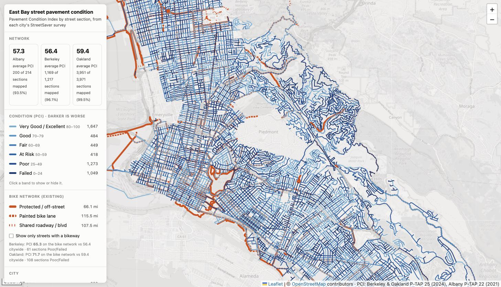
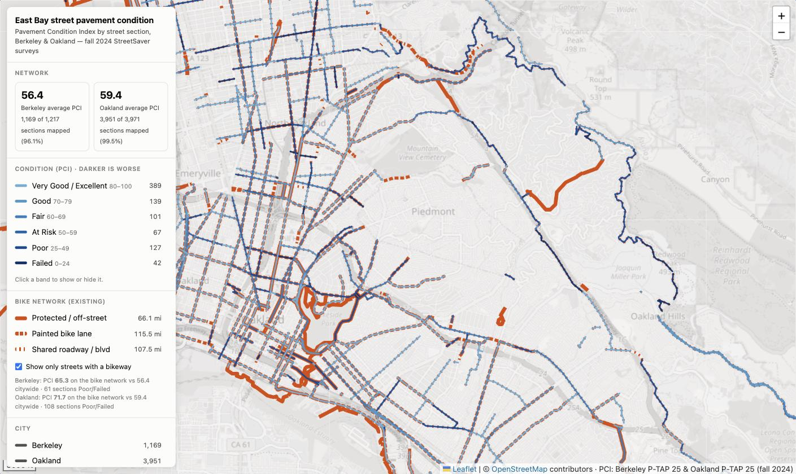

# East Bay street pavement quality

An interactive map of street pavement condition (PCI, 0–100) in Berkeley and
Oakland, built from the two cities' late-2024 StreetSaver survey reports and
joined to street geometry.

**[View the map →](https://muzakandpotatoes.github.io/east-bay-road-quality/)**

Or build it locally: `./run_all.sh` writes `east_bay_pavement_map.html`, one
self-contained file (1.3 MB), no server needed.

The published page is built by GitHub Actions from `data/out/payload.json` and
uses OpenStreetMap tiles. The local build uses Tracestrack if a key is present
— see [Rebuilding](#rebuilding). The built HTML is deliberately not committed,
because with a key it embeds a credential.



## What came out

| | Berkeley | Oakland |
|---|---|---|
| Sections in the report | 1,217 | 3,971 |
| Sections mapped | 1,169 (**96.1%**) | 3,951 (**99.5%**) |
| Unmatched | 48 (3.9%) | 20 (0.5%) |
| Area-weighted PCI (report) | 56.4 → **56** | 59.5 → **60** |
| Area-weighted PCI (mapped subset) | 56.4 | 59.4 |

The mapped subset's weighted PCI tracks the citywide figure closely in both
cities, so dropping the unmatched sections does not bias the picture.

Outputs in `data/out/`:

| File | What it is |
|---|---|
| `east_bay_pci.geojson` / `.csv` | the joined dataset, 5,120 sections (CSV carries WKT geometry) |
| `berkeley_join_report.json`, `oakland_join_report.json` | per-city match rates and **every unmatched row with the reason** |
| `berkeley_paving_plan.geojson`, `oakland_paving_plan.geojson` | 5-year paving plan overlays |
| `berkeley_moratorium.geojson`, `oakland_moratorium.geojson` | paving-moratorium overlays |
| `summary.json` | counts per MTC condition band |

## Sources

- Berkeley, *2024 Pavement Management Plan Update (P-TAP 25)* — Section IV
  street-section listing.
- Oakland, *P-TAP Round 25* — Appendix C, Section PCI/RSL listing.
- Berkeley FY2027–31 Five-Year Street Rehabilitation Plan and Measure FF plan;
  Berkeley streets-on-moratorium list.
- Berkeley centerlines: `gis.cityofberkeley.info` `Planning/Accela/3`.
- Oakland pavement sections: `Paving_PCI_2024Values` (ArcGIS Online); moratorium:
  `gismaps.oaklandca.gov` `OaklandStreets`.

## How it works

### 1. Reading the PDFs

Both appendices are multi-page tables whose cells wrap and whose street names
and cross streets contain spaces, so flattened line text is ambiguous. Columns
are cut geometrically on each word's x-midpoint, and rows are recovered by
clustering words on y — a fixed rounding grid splits rows, because some cells
render up to 0.5 pt below their row's baseline. (That bug silently blanked the
street name on ~162 Berkeley rows before it was caught.)

Berkeley's plan and moratorium PDFs *are* ruled tables, so those use
pdfplumber's native table detection instead; the plan re-lays its columns on
every page, which defeats fixed column positions.

**Every extraction is gated on the reports' own control totals** and the scripts
exit non-zero if they disagree:

```
Oakland   OK sections 3,971 (report 3,971)   OK area 149,446,612 ft² (report 149,446,612)
          OK length 4,465,574 ft (report 4,465,574)   OK weighted PCI 59.5 (report 60)
Berkeley  OK sections 1,217 (report 1,216)   OK area 39,367,093 ft² (report 39,363,218)
          OK weighted PCI 56.4 (report 56)
```

The plan extract is checked the same way, per fiscal year, against the section
counts and mileage printed on each page — all ten groups match exactly.

Note the "~3,304 sections" figure often quoted for Oakland is the number of
sections *physically surveyed*; Appendix C covers the whole managed network of
3,971.

### 2. Joining to geometry

**Oakland is an exact key join.** The city's GIS publishes the StreetSaver
sections themselves, carrying the same `STREETID`/`SECTIONID` the report prints
— so there is no guessing. 99.5% of rows find their section.

That layer also has its own `PCI_2024` column, used purely as a cross-check: 78%
of sections agree with the report within a point, with a systematic −1 offset on
most of the rest (the layer rounds where the report truncates). The mapped value
always comes from the report.

**Berkeley is the hard case** — it publishes no section geometry, so each row,
keyed only by street name plus from/to cross streets, has to be located on the
centerline network (`scripts/linref.py`):

1. Build a graph of centerline segments, snapping endpoints within 2 m to shared
   nodes, and split segments wherever another street's endpoint touches them —
   without that, a side street that ends mid-block has no shared node and the
   block cannot be addressed by its cross streets at all.
2. An *anchor* for a cross street is any node on the subject street that another
   edge of that name also touches.
3. The section is the shortest path along the subject street's own edges between
   the two anchors.
4. Where a street meets a cross street more than once, every anchor pair is
   tried and the one whose length best matches the length printed in the report
   wins — and that reported length then gates the result (>35% disagreement is
   rejected).

Names are normalised for suffixes (`AV`/`AVE`, `BV`/`BLVD`), numeric ordinals
(`1 AV` → `1ST AVE`), leading directions and articles, `MC GEE`/`MCGEE`, plus a
few genuine aliases (`M L KING JR WAY` → `MARTIN LUTHER KING JR WAY`, and two
misspellings in Berkeley's own PDF).

From/to labels are not always cross streets. `CITY LIMIT (DOVER ST)` hides the
real one in the parenthetical; `DEAD END (ACTON ST)` names the street the
cul-de-sac hangs off rather than a second intersection; others are landmarks
(`AQUATIC PARK`, `BARTD`, `RRX`) or offsets (`374' E/O MARTIN LUTHER KING JR
WAY`). Where only one end is a firm point, the section is walked out from it to
the reported length — **but only when one direction can accommodate that length**,
since otherwise the block could land on the wrong side of the intersection.

Match quality on the 1,169 Berkeley sections: median length error **1.0%**, p90
6.8%, and total matched geometry within **0.05%** of total reported length. Every
spot-checked section touches both of its named cross streets at 0 m.

Three later refinements took Berkeley from 93.0% to 96.1%:

- **Bridging same-street gaps.** The centerline layer stops many streets at the
  kerb line rather than the intersection centre, leaving 13–25 m holes where a
  cross street passes — **37% of street names arrived in more than one piece**.
  A section spanning such a hole had no path between its cross streets. Pieces of
  the *same* name separated by under 30 m are now joined, which is far shorter
  than a block, so two different streets can never be connected. (This is what
  was dropping Hillegass Ave between Dwight and Ashby.)
- **An OpenStreetMap fallback** (`fetch_osm.py`), admitted only for names absent
  from the city layer, so OSM never competes with authoritative geometry. It
  supplies 194 names — 62nd–67th St on the Oakland border, Kala Bagai Way,
  Quarry Rd.
- **A second pass that uses the table against itself.** A section with only one
  firm cross street (the other end being a rail crossing, a park, a city limit)
  is ambiguous alone — it could sit on either side of the intersection. But the
  neighbouring sections of the same street have already claimed one side, so the
  block must be on the other. This placed 27 more sections, and still refuses
  when the direction stays ambiguous.

**Unmatched sections are left out, never guessed.** All 48 are listed with their
reason in `berkeley_join_report.json`. The residue is landmark from/to labels at
*both* ends (`AQUATIC PARK` → `3RD ST (RR TRACKS)`), sections whose reported
length disagrees with the network by more than the tolerance, and two streets
absent from every source (Forrest Lane, South Hospital Drive).

### 3. The map

Leaflet over a desaturated Tracestrack basemap (see Rebuilding). PCI is
coloured on the standard MTC breaks
(0–24 failed, 25–49 poor, 50–59 at risk, 60–69 fair, 70–79 good, 80–100 very
good/excellent).

The ramp is **a single-hue blue** (matplotlib `Blues` sampled over t = 0.50 →
1.00), dark for worse. Lightness is monotonic and near-evenly spaced (OKLab L
0.32 → 0.72, steps of 0.070–0.093), so condition reads as "darker is worse"
before any colour is named, and every band clears 2.2:1 against the basemap.

It replaced two earlier ramps, and the reasons are worth keeping:

- A **diverging red↔blue** ramp put dark maroon at one end and dark navy at the
  other. They measured ΔE 19.6 apart and passed a categorical palette check, but
  their *mutual contrast was 1.13:1* — the same lightness, differing only in hue.
  At patch size that is fine; at a 3px line width hue discrimination collapses
  and lightness dominates, so the two extremes read as one colour. **A thin-line
  map must separate its classes by lightness, and a validator run at patch size
  will not catch it.**
- **`plasma` truncated to t ≤ 0.72** fixed that (ends 6.2:1 apart) but spanned
  violet → magenta → orange, consuming most of the hue wheel. That left nowhere
  for the bike casing: the teal it forced measured **CVD ΔE 7.9** against the
  ramp — the reason the casing was hard to see.

Collapsing the ramp to one hue is what makes the bike layer legible. Six steps
spanning the lightness range leave no lightness free — some band always matches
any casing — so the casing can only be told apart by **hue**, and a blue ramp
leaves the whole warm half of the wheel for it. Burnt orange `#d94801` scores
**CVD ΔE 22.1** against the worst-case ramp step, nearly three times the teal it
replaced. The cost is end separation, 5.2:1 rather than plasma's 6.2:1.

**An isoluminant ramp was tested and rejected.** Holding lightness constant and
varying only hue would free the lightness channel for the casing, which is the
right instinct — but measured at L = 0.60 it gives a worst adjacent **CVD ΔE of
4.0** against the blue ramp's 6.9, is gamut-limited to low chroma, and above all
destroys ordinality: with no lightness difference, two bands cannot be ranked at
all. That is precisely the 1.13:1 failure above, generalised to every pair. The
arrangement here is the useful dual — the ordinal variable gets the ordinal
channel (lightness), and the categorical one gets hue.

Overlay colours sit outside the ramp's hue: burnt orange for bike casings,
green for paving plans, neutral slate for the moratorium.

The legend names every band with its PCI range and section count, and the popup
states the exact score, so condition is never carried by colour alone.

Line weight scales with zoom. Click any street for PCI, remaining service life,
functional class, surface type, dimensions, survey date, last treatment, and how
that geometry was matched. The legend filters by condition band and by city;
paving-plan and moratorium overlays toggle on top.

## Rebuilding

```bash
pip install pdfplumber shapely pyproj
echo 'TRACESTRACK_API_KEY=...' > .env     # or export it
./run_all.sh
```

Two things need a hand:

- **Basemap key.** Tiles come from [Tracestrack](https://tracestrack.com/), which
  needs an API key — public OSM tiles proved unreliable in practice. `build_map.py`
  reads `TRACESTRACK_API_KEY` from the environment or a local `.env`, and falls
  back to OpenStreetMap tiles if neither is set, so the build never hard-fails.
  Only the `topo__` style is enabled on the current key; it is desaturated in CSS
  down to a muted grey base so the PCI lines carry all the colour.

  **The key is injected into the generated HTML**, so `east_bay_pavement_map.html`
  contains a credential. Both it and `.env` are gitignored. Before sharing the map
  outside your control, either rebuild it without a key (it falls back to OSM) or
  use a key with a referrer restriction.

- **Oakland's PDF.** `www.oaklandca.gov` sits behind an Akamai rule that refuses
  non-browser clients (403 for the whole domain), so its P-TAP 25 report has to be
  downloaded in a browser and saved to `data/raw/oakland_ptap25.pdf`. Everything
  else fetches automatically. `run_all.sh` tells you this and stops if it is
  missing.

## Bikeways



The existing bike network is drawn as a teal casing *under* the PCI lines, and
"Show only streets with a bikeway" filters the map to it. Condition already owns
colour, so a second colour scale on the same streets would be unreadable — tier
is carried by line weight and dash instead:

| | casing | |
|---|---|---|
| Protected / off-street | solid, 2.3× the PCI line | 66.1 mi |
| Painted bike lane | long dashes, short gaps, 1.9× | 115.5 mi |
| Shared roadway / boulevard | short ticks, long gaps, 1.6× | 107.5 mi |

**Tier is carried mainly by how broken the casing is, not by its width.** Width
alone was too subtle to read — protected and painted differed only by 2.3× vs
1.9× and were hard to tell apart without something adjacent to compare against.
Dash density is both easier to see and a better fit for what the tiers mean: an
unbroken edge for continuous protection, close ticks for a painted stripe,
sparse ticks for markings only. Width still varies in the same direction, so
the two cues reinforce each other.

Both the casing width **and** the dash pattern are multiples of the PCI line
weight rather than fixed pixel values, so the whole thing holds its proportions
at every zoom. An additive width offset had made the casing 6.8× the line at z11
and 1.8× at z18; a fixed dash would have done the same to the tick spacing.
Casings are **fully opaque**: translucent ones compounded where routes crossed
and darkened the intersections. The legend swatches draw the real patterns.

**The casing reuses each PCI section's own geometry** rather than the bikeway
source geometry. The first attempt drew a merged union of the four sources;
because they trace the same street several metres apart, the leftover fragments
rendered as a string of blobs. Drawing the casing from the section line the
colour already uses means it can only ever sit exactly underneath.

That leaves off-street paths — the Bay Trail, the Ohlone Greenway, park paths —
which are not city streets and have no PCI section. Those keep their own
geometry (342 whole features, deduplicated at feature level so they stay
continuous). The split is informative in itself: of Berkeley's protected
mileage, 8.6 mi is on-street cycletrack and 13.3 mi is off-street path.

**Three tiers rather than the seven Caltrans classes**, because the merge
analysis below shows the sources agree on *where* bikeways are but not on what
class they are — and nearly all of that disagreement is *within* a tier
(III/IIIA/IIIB are all shared roadway; a cycletrack mapped in OSM as its own way
reads as Class I but is Class IV, and both are protected). Tiering absorbs the
unreliable distinctions and keeps the reliable one.

Putting the two datasets together answers a question neither can alone:

| | PCI on bike network | citywide | Poor/Failed on network |
|---|---|---|---|
| Berkeley | **65.3** | 56.4 | 61 of 240 (25%) |
| Oakland | **71.7** | 59.4 | 108 of 625 (17%) |

Bike routes sit on markedly better pavement than the city average — but a
quarter of Berkeley's bike network is still Poor or Failed. `bike_overlay.py`
tags every PCI section with `bike_tier` and emits the off-street residual, so
the filter and the casings cost the browser no geometry work.

Only *existing* bikeways are mapped. Oakland's proposed network is 314 mi — five
times what is built — and would swamp the map; Berkeley's Tier 1 recommendations
need geocoding through the centerline matcher first. Both are collected and
normalised, ready to add.

`./run_bikeways.sh` collects and normalises bicycle infrastructure for both
cities into `data/out/bikeways.{geojson,csv}` — 6,288 segments on one schema
(`city, source, status, bikeway_class, class_label, street, from/to, miles,
class_raw, year`). Classes follow Caltrans, as both cities do: I shared-use
path, II bike lane, IIB upgraded/buffered, III bike route, IIIA sharrows,
IIIB bicycle boulevard, IV separated bikeway.

**Sources are kept separate and not deduplicated**, because they disagree about
completeness and vintage and picking a winner per class is a map decision. The
yardstick is Table 4 of the *Berkeley Bicycle Plan 2026*, the only authoritative
statement of what is actually built (60.9 mi in 2025):

| Source | Existing mi | Note |
|---|---|---|
| Oakland GIS BikeNetwork | 202.0 | current, `YEARCURREN` runs to 2025 — authoritative for Oakland |
| OpenStreetMap (Berkeley) | 54.0 | 89% of the plan's 60.9 mi; best single Berkeley source |
| Berkeley GIS Bicycle Boulevards | 16.0 | vs 12.5 mi boulevard / 17.6 mi boulevard *network* |
| Berkeley GIS Bikeways | 38.6 | classes date to 2004 — stale |
| Berkeley GIS Separated Bikeways | 1.7 | vs 4.2 mi actual — partial (Milvia only) |

No single Berkeley source reproduces Table 4, so `merge_analysis.py` measures
what merging them actually buys: sources are added one at a time, and each is
credited only with length not already covered within 15 m by the geometry
accepted before it.

**Merging recovers the extent of the network but not its classification.**

| Class | best single source | merged | plan 2025 |
|---|---|---|---|
| I shared-use path | 11.4 (OSM) | **14.3** | 18.9 — 76% |
| II bike lane | 12.6 (OSM) | 15.8 | 10.9 — 145% |
| IIB upgraded lane | 0.5 (OSM) | **0.5** | 1.8 — 25% |
| III bike route | 16.4 (GIS 2004) | 16.4 | 12.6 — 130% |
| IIIA sharrows | 21.5 (OSM) | 21.5 | (also 12.6) |
| IIIB bicycle boulevard | 16.0 (city) | 16.1 | 12.5 — 129% |
| IV separated | 3.4 (OSM) | **3.9** | 4.2 — 92% |
| **any class, street counted once** | 54.5 (OSM) | **60.5** | **60.9 — 99%** |

So for "which streets have bike infrastructure", the merge is essentially
complete: 60.5 of 60.9 mi, with OSM contributing 36.9 mi on top of the city
layers and the stale 2004 layer still adding a final 6.7 mi that nothing else
has. For "what class is it", the merge is not usable as-is — Class III is
over-claimed roughly threefold once OSM's sharrows (21.5 mi) are added to the
2004 layer's bike routes (16.4 mi) against a plan figure of 12.6 mi, because
OSM tags sharrows on many streets the city does not count as bikeway at all.

Two class-level gaps are worth flagging rather than papering over:

- **Class IV is 3.9 of 4.2 mi merged (92%)** — the city's own separated-bikeway
  layer holds only 1.7 mi and OSM adds 2.1 mi of that.
- **Class I is 14.3 of 18.9 mi (76%)** and is unexplained. Two hypotheses were
  tested and both failed: widening the OSM fetch box to the full city boundary
  (including the Marina) added 0.5 mi and no Class I, and pulling
  `highway=path/footway` with `bicycle=designated|yes` returned 7.9 mi that is
  mostly UC campus walkways where cycling is merely permitted, not Class I
  paths. There is 19.2 mi of `highway=cycleway` immediately outside the city
  limits (Ohlone Greenway, Bay Trail, Emeryville), so the plan may count paths
  that straddle the boundary — but that is a guess, not a finding.

Proposed/planned network:

- **Oakland** — 313.9 mi, from the same layer's `PROPOSEDCL` column.
- **Berkeley** — the plan's Tier 1 project list (Table 11): 90 rows extracted and
  gated on the plan's own control total (**$14,276,500** capital cost, matched to
  the dollar), of which 23 are linear bikeways (15.3 mi) and 67 are spot
  treatments (beacons, traffic circles, diverters). These have **no geometry
  yet** — they are street + cross-street rows, so they need the same centerline
  matcher the PCI sections use. That is the natural next step.

The plan's network maps (Figures 5 and 13) are raster figures, so segment-level
*existing* geometry is not recoverable from the PDF.

## Caveats

- **State highways are absent from both reports.** These are pavement-management
  programs for *city-maintained* streets, so Caltrans routes never appear — in
  Berkeley that means San Pablo Ave (SR-123) and Ashby Ave (SR-13), which show up
  51 and 59 times as *cross* streets and zero times as subject streets. They are
  blank on the map because the cities do not survey them, not because the join
  failed. Freeways are excluded for the same reason.
- **PCI measures structural distress, not ride quality** — cracking, patching and
  deformation. A street can feel rough and still score well.
- **Oakland's survey sampled 44.9% of network area** (3,304 of 3,971 sections
  inspected Sept–Dec 2024); the rest are modelled from deterioration curves, not
  observed. The map does not distinguish the two, because the report's
  section-level listing does not.
- **The data is fall 2024** and predates Berkeley's Measure FF paving spending.
- **Presence on a paving plan is not a worst-first ranking** — plans reflect
  StreetSaver cost-effectiveness and equity-zone priorities, so mid-condition
  streets are often treated ahead of failed ones.
- Berkeley's moratorium and plan overlays come from the current PDFs. The
  equivalent ArcGIS layers (`PubWorks/10`, `PubWorks/11`) are stale — plan years
  2020–24 and moratoriums expiring by early 2025 — and are not used. Oakland's
  `5YP_Schedule` services are likewise a 2016–2021 vintage; its plan overlay comes
  from the `PLAN_2022` column on the pavement-section layer instead.
